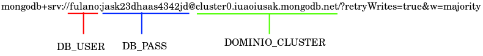
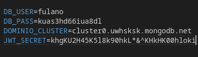

# Futura Beauty Hub

API para marketplace de cosméticos, produtos de beleza e de higiêne. Escrita na linguagem **Node.js** e no framework **Express.js**, com banco de dados **MongoDB**. 

## Rodando localmente
1. Clone o repositório 
```bash
git clone https://github.com/dev-gsilv/futurabeutyhubapi
```
2. Instale as dependências
```bash
  npm install
```
3. Crie um banco de dados gratuito no MongoDB Atlas, [clique aqui](https://account.mongodb.com/account/login?nds=true). Veja um tutorial [aqui](https://www.coderrocketfuel.com/article/create-and-connect-to-a-mongodb-atlas-database-with-node-js);
4. Na raiz do projeto clonado, crie um arquivo de variáveis de ambiente `.env`;
5. Adicione as seguintes variáveis de ambiente: 
- `DB_USER`: nome de usuário de seu banco de dados MongoDB;
- `DB_PASS`: senha de seu banco de dados MongoDB;
- `DOMINIO_CLUSTER`: nome de domínio do cluster de seu banco de dados MongoDB. Semelhante a _clustername0.xmwufns.mongodb.net_;
- `JWT_SECRET`: uma string aleatória para configuração do token de acesso JWT.

> Exemplo do _conexion string_ fornecido pelo MongoDB.

> Exemplo de preenchimento do arquivo _.env_



6. Inicie o servidor
```bash
  npm start
```
7. Sua API estará rodando localmente, teste a resposta do servidor [aqui](http://localhost:3000/healthcheck).

***

### Documentação da API

#### Acesso via Basic Auth

```http
  POST /login
```

| Parâmetro   | Tipo       | Descrição                           |
| :---------- | :--------- | :---------------------------------- |
| `email` | `string` | **Obrigatório**. E-mail e identificação única do usuário |
| `senha` | `string` | **Obrigatório**. Senha do usuário |


#### Criar um novo usuário

```http
  POST /registrar
```

| Parâmetro   | Tipo       | Descrição                           |
| :---------- | :--------- | :---------------------------------- |
| `nome` | `string` | **Obrigatório**. Nome do usuário. |
| `email` | `string` | **Obrigatório**. E-mail e identificação única do usuário |
| `senha` | `string` | **Obrigatório**. Senha do usuário |


#### Criar um novo produto

```http
  POST /produtos
```
> Autenticação via token JWT

| Parâmetro   | Tipo       | Descrição                           |
| :---------- | :--------- | :---------------------------------- |
| `nome` | `string` | **Obrigatório**. Nome do produto. |
| `marca` | `string` | Marca do produto. |
| `ingredientes` | `string` | Composição do produto. |
| `indicacao` | `string` | Indicações de uso. |
| `volume` | `string` | Volume ou peso do produto. |
| `preco` | `decimal` | **Obrigatório**. Valor decimal do produto. |
| `disponibilidade` | `boolean` | **Obrigatório**. Indicador de disponibilidade do produto. |
| `categoria` | `string` | **Obrigatório**. Categoria(s) do produto. |
| `imagem` | `string` | **Obrigatório**. Imagem ilustrativa do produto. |

#### Buscar os dados de um ou mais produtos

```http
  GET /produtos
```

| Parâmetro    | Tipo       | Descrição                           |
| :---------- | :--------- | :---------------------------------- |
| `categoria` | `string` | Categoria do produto. Usado isoladamente ou em associação com `idUsuario`|
| `idUsuario` | `string` | ID do usuário criador do produto. Usado isoladamente ou em associação com `categoria`|

#### Buscar a imagem de um produto

```http
  GET /produtos/:id/imagem
```

| Parâmetro    | Tipo       | Descrição                           |
| :---------- | :--------- | :---------------------------------- |
| `idProduto` | `string` | ID do produto. |

#### Editar os dados de um produto

```http
  PUT /produtos/:id
```
> Autenticação via token JWT

| Parâmetro   | Tipo       | Descrição                           |
| :---------- | :--------- | :---------------------------------- |
| `nome` | `string` | Nome do produto. |
| `marca` | `string` | Marca do produto. |
| `ingredientes` | `string` | Composição do produto. |
| `indicacao` | `string` | Indicações de uso. |
| `volume` | `string` | Volume ou peso do produto. |
| `preco` | `decimal` | Valor decimal do produto. |
| `disponibilidade` | `boolean` | Indicador de disponibilidade do produto. |
| `categoria` | `string` | Categoria(s) do produto. |
| `imagem` | `string` | Imagem ilustrativa do produto. |

#### Remover um produto

```http
  DELETE /produtos/:id
```
> Autenticação via token JWT

| Parâmetro    | Tipo       | Descrição                           |
| :---------- | :--------- | :---------------------------------- |
| `idProduto` | `string` | ID do produto. |

## Autores

- [@dev-gsilv](https://github.com/dev-gsilv)
- [@Leopagoti](https://github.com/Leopagoti)
